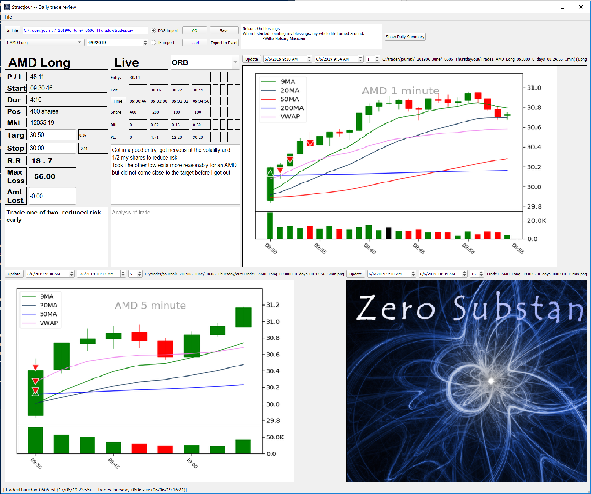
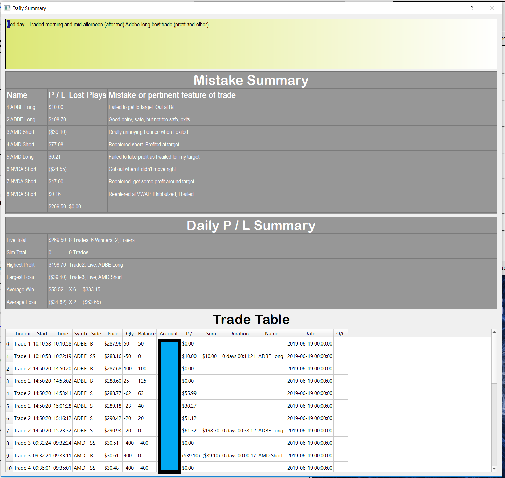
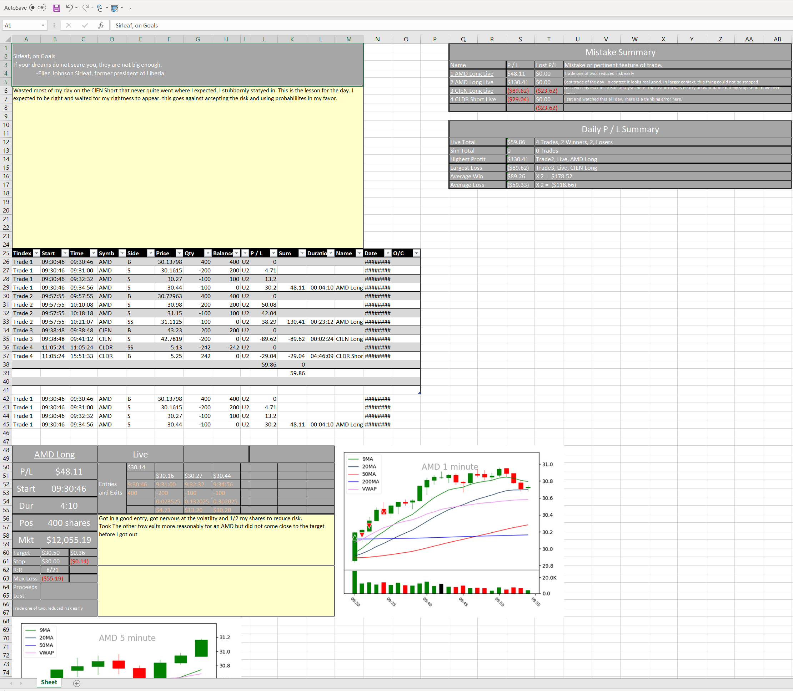
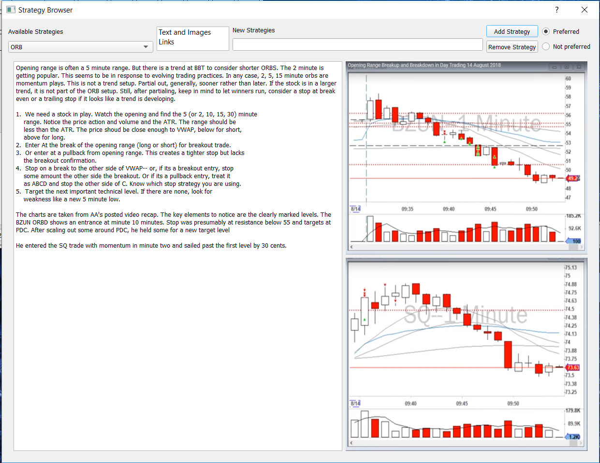

# Structjour - A daily review helper for day traders

Features include chart generation using IB API gateway or the free APIs from Barchart and  Alphavantage. The IEX API is also set up to use but the data is better suited for end of day reporting. If you have all three APIS setup, structjour will choose one based on availability and your set preference. Charts are configurable for start, end  and candle interval and can be set interactively (zoom in etc.). Generic matplotlib styles can be selected. Four configurable MAs can be shown. If you would rather use your own charts from DAS or elsewhere, charts can be opened from the file system or pasted from the clipboard. All charts are stored in a directory for that day.

Input files are limited to DAS Trader PRO exports and IB statements (Activity, Trade and Flex statements). At some point in the future, other formats will be added.

Review data includes setting your original target and stop loss. Exceeding your stop loss will trigger an amount lost to be shown. The Amount lost can be used to display and explain missing potential income. Each trade has a notes and analysis section. 

The daily summary displays your summary notes for each trade and provides a place to describe the events of the day

Navigation between days is done with a date widget. Change the date and the file(s) for that date can be loaded.

Export to Excel places all the trade summaryies and daily summaries on one sheet.
 

A Strategy Browser supports the user's strategy descriptions. From here, you manage the strategies that are listed in the combo box on the front page.
 
A second tab of the Strtegy Browser should support viewing a list of html urls (local or not) but its currently disabled. I think it is a problem with a conflicting version of PyQtWebEngine. For now, I am leaving it in place (browsing/scrolling disabled) until I can remedy the conflicting PyQt5 stuff. Here is what it looks like. If you have expertise in this area (PyQtWebEngine), please help.
 

The state of the software is pre-alpha. I created it for my own use based on what I needed. I believe the scope of features has grown (or is growing) to be more generally useful.  It has only ever run on Windows and on my personal system. Das Trader Pro is a Windows application. Now that it also supports IB Statements, it makes sense to make it available on other systems. The only issue I am aware of is the PILLOW image library. Its used to retrieve clipboard data. I think it is a Windows specific call.  The overall design and ideas were generated from listening and studying the ideas of the moderators and members of Bear Bull traders. All shortcomings are completely my own.

Database support is in the queue. Future versions will include more long term analysis tools. Currently, there is an export to a pre-existing Excel tool called DisciplinedTrader, lightly tweaked. It gives a longer term analysis view of trades. Alternately to implementing analysis tools in Qt, structjour could support any arbitray Excel analysis tool by request.

There is currently no release. An alpha release is planned within a couple months. Its written entirely in python3 using recent versions of PyQt5, pandas, matplotlib, BeautifulSoup, and openpyxl. There will be a release but if you want to see it on your desktop now and you have some experience in python the main program is currently run from the script at structjour/view/runtrade.py. The directory structure required to store the files can be created by running structjour/time.py in your journal directory. The script will ask for a month and create subdirs for each day.

If you are interested in contributing, I would welcome your help and input in any and all areas of design, implementation and bug reports.

